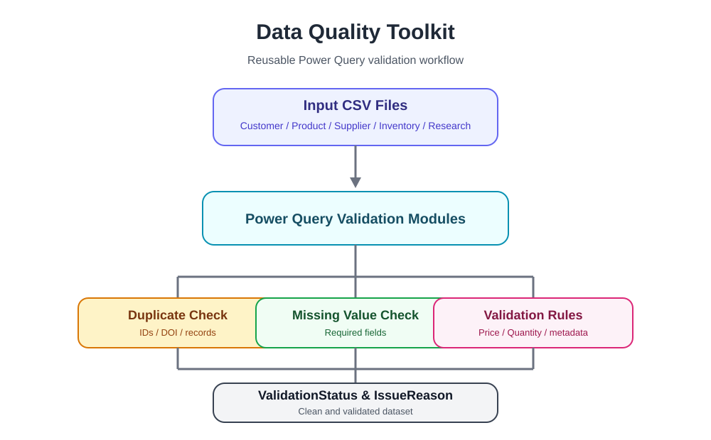

# Data Quality Toolkit

Reusable Power Query toolkit for data cleaning, validation, and transformation workflows.

Built with Power Query (M) for customer, product, supplier, inventory, invoice, and research datasets.

---

## Architecture



---

## Features

✓ Remove Duplicates

✓ Missing Value Detection

✓ Validation Status Flags

✓ Issue Reason Generation

✓ Text Normalization

✓ Validation Rules

✓ Data Transformation

✓ Reporting

✓ Power Query (M)

✓ Reusable Validation Pipelines

✓ Customer Data Validation

✓ Product Data Validation

✓ Supplier Validation

✓ Inventory Validation

✓ Invoice Validation

✓ Research Metadata Validation

✓ DOI Quality Checks

---

## How It Works

```text
Input CSV
      │
      ▼
Power Query Validation
      │
      ▼
Validation Rules
      │
      ▼
Validation Status
      │
      ▼
Issue Reason
      │
      ▼
Validated Output
```

The toolkit applies reusable validation rules to structured datasets and generates standardized validation results that can be reused across Business Operations, Data Analytics, and Research workflows.

---

## Sample Output

Example workflow:

```text
samples/invoice_master.csv
        │
        ▼
InvoiceValidation.m
        │
        ▼
samples/output/invoice_validation_result.csv
```

The sample output demonstrates how validation columns are added while preserving the original dataset.

Generated columns include:

- IsDuplicateInvoiceID
- MissingCustomerID
- MissingInvoiceDate
- InvalidAmount
- ValidationStatus
- IssueReason

---

## Example Use Cases

### Customer Master Validation

- Duplicate customer detection
- Missing customer names
- Missing email addresses
- Validation status flags
- Standardized names
- Address cleanup

### Product Catalog Validation

- SKU normalization
- Missing product information
- Category cleanup
- Duplicate products
- Price validation
- Product quality checks
- Issue reason generation

### Supplier Master Validation

- Duplicate supplier detection
- Missing supplier names
- Missing email addresses
- Missing countries
- Validation status generation
- Supplier data quality checks

### Inventory Validation

- Duplicate inventory detection
- Missing product IDs
- Missing warehouse information
- Invalid inventory quantities
- Validation status generation
- Inventory data quality checks

### Invoice Validation

- Duplicate invoice detection
- Missing customer IDs
- Missing invoice dates
- Invalid invoice amounts
- Validation status generation
- Invoice quality checks

### Research Metadata Validation

- DOI parsing
- Duplicate DOI detection
- Missing DOI detection
- Missing titles
- Missing authors
- Validation status generation
- Metadata consistency checks

---

## Repository Structure

```text
queries/
    CustomerValidation.m
    ProductValidation.m
    SupplierValidation.m
    InventoryValidation.m
    InvoiceValidation.m
    ResearchMetadataValidation.m

samples/
    customer_master.csv
    product_catalog.csv
    supplier_master.csv
    inventory_master.csv
    invoice_master.csv
    research_metadata.csv

    output/
        invoice_validation_result.csv

images/
    architecture.svg

shared/
    README.md
    TrimText.m
    EmptyToNull.m

README.md

LICENSE
```

---

## Included Modules

### CustomerValidation.m

Features

- Trim whitespace
- Convert empty values to null
- Detect duplicate customer records
- Detect missing names
- Detect missing emails
- Add validation status flags
- Normalize customer records

Location

```text
queries/CustomerValidation.m
```

---

### ProductValidation.m

Features

- Trim whitespace
- Convert empty values to null
- Detect duplicate ProductID
- Detect missing SKU
- Detect missing product names
- Detect missing categories
- Detect invalid prices
- Add validation status flags
- Generate issue reason messages

Location

```text
queries/ProductValidation.m
```

---

### SupplierValidation.m

Features

- Trim whitespace
- Convert empty values to null
- Detect duplicate SupplierID
- Detect missing supplier names
- Detect missing email addresses
- Detect missing countries
- Add validation status flags
- Generate issue reason messages

Location

```text
queries/SupplierValidation.m
```

---

### InventoryValidation.m

Features

- Trim whitespace
- Convert empty values to null
- Detect duplicate InventoryID
- Detect missing ProductID
- Detect missing Warehouse
- Detect invalid quantities
- Add validation status flags
- Generate issue reason messages

Location

```text
queries/InventoryValidation.m
```

---

### InvoiceValidation.m

Features

- Trim whitespace
- Convert empty values to null
- Detect duplicate InvoiceID
- Detect missing CustomerID
- Detect missing InvoiceDate
- Detect invalid invoice amounts
- Add validation status flags
- Generate issue reason messages

Location

```text
queries/InvoiceValidation.m
```

---

### ResearchMetadataValidation.m

Features

- Trim whitespace
- Convert empty values to null
- Detect duplicate DOI
- Detect missing DOI
- Detect missing titles
- Detect missing authors
- Add validation status flags
- Generate issue reason messages

Location

```text
queries/ResearchMetadataValidation.m
```

---

## Sample Datasets

### customer_master.csv

- CustomerID
- Name
- Email

Validation scenarios

- Duplicate CustomerID
- Missing Name
- Missing Email
- Text normalization

### product_catalog.csv

- ProductID
- SKU
- ProductName
- Category
- Price

Validation scenarios

- Duplicate ProductID
- Missing SKU
- Missing Product Name
- Missing Category
- Invalid Price
- Issue Reason Generation
- Text normalization

### supplier_master.csv

- SupplierID
- SupplierName
- Email
- Country
- Phone

Validation scenarios

- Duplicate SupplierID
- Missing Supplier Name
- Missing Email
- Missing Country
- Validation Status
- Issue Reason Generation

### inventory_master.csv

- InventoryID
- ProductID
- Warehouse
- Quantity

Validation scenarios

- Duplicate InventoryID
- Missing ProductID
- Missing Warehouse
- Invalid Quantity
- Validation Status
- Issue Reason Generation

### invoice_master.csv

- InvoiceID
- CustomerID
- InvoiceDate
- Amount

Validation scenarios

- Duplicate InvoiceID
- Missing CustomerID
- Missing InvoiceDate
- Invalid Amount
- Validation Status
- Issue Reason Generation

### research_metadata.csv

- DOI
- Title
- Author
- Journal
- Year

Validation scenarios

- Duplicate DOI
- Missing DOI
- Missing Title
- Missing Author
- Validation Status
- Issue Reason Generation

---

## Technical Highlights

✓ Power Query (M)

✓ ETL Workflows

✓ CSV Import

✓ Duplicate Detection

✓ Missing Value Checks

✓ Validation Status Flags

✓ Issue Reason Generation

✓ Text Normalization

✓ Reusable Validation Pipelines

✓ Metadata Processing

✓ DOI Quality Checks

✓ Robust Number Conversion

✓ Data Quality Automation

---

## Built With

- Microsoft Excel
- Power Query
- M Language

---

## Shared Functions

The toolkit is evolving into a reusable Power Query validation framework.

### Implemented

```text
TrimText.m
EmptyToNull.m
```

### Planned

```text
BuildValidationStatus.m
BuildIssueReason.m
```

These shared functions reduce duplicated logic, simplify maintenance, and provide a consistent validation workflow across all validation modules.

---

## Roadmap

### v0.7

□ AddressValidation.m

### v0.8

□ SalesValidation.m

### v0.9

□ EmployeeValidation.m

### v1.0

□ Shared Validation Functions

□ Validation Dashboard

□ Error Reporting

□ CSV Export

□ Excel Export

□ Batch Processing

### Future

□ Power Query Data Quality Library

□ Publish reusable shared functions

□ GitHub Pages documentation

□ Example output gallery

---

## Vision

Data Quality Toolkit is designed to become a reusable Power Query validation framework for Business Operations, Data Analytics, Data Engineering, and Research workflows.

The long-term goal is to build an open, reusable **Power Query Data Quality Library** that helps organizations standardize data quality validation across projects.

---

## License

MIT © 2026 Seiko K

---

Created by Seiko-K
